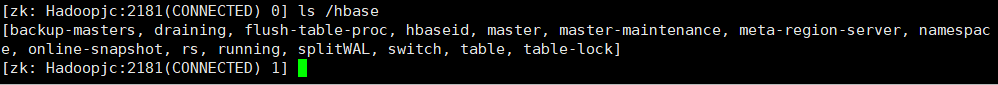

# Hadoop-Practice

Basic Programming Practice of Big Data

```bash
cd /usr/local/hadoop
zkServer.sh start
hdfs --daemon start journalnode
start-dfs.sh
start-yarn.sh
mr-jobhistory-daemon.sh start historyserver

start-hbase.sh

hive --service metastore &
hive --service hiveserver2 &

start-cluster.sh


STOP-----------------------------------------------------

stop-hbase.sh
stop-yarn.sh
stop-dfs.sh
mr-jobhistory-daemon.sh stop historyserver
hdfs --daemon stop journalnode

zkServer.sh stop
```

**注意：若在操作HBase的过程中发生错误，可以通过{HBASE\_HOME}目录（/usr/local/hbase）下的logs子目录中的日志文件查看错误原因。**

** 这里启动关闭Hadoop和HBase的顺序一定是：**

** 启动Hadoop—>启动HBase—>关闭HBase—>关闭Hadoop**


| 服务               | IP                         |
| ------------------ | -------------------------- |
| HDFS               | http://172.16.222.20:9870  |
| YARN               | http://172.16.222.20:8088  |
| HBase Master       | http://172.16.222.20:60010 |
| HBase RegionServer | http://172.16.222.20:60030 |
| Hive               | http://172.16.222.20:10002 |

```shell
#查看 HBase 在 Zookeeper 中的 znode
zkCli.sh -server Hadoopjc:2181

ls /hbase
```


