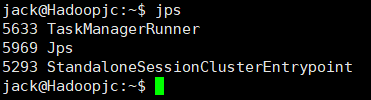

```shell
cd ~/Downloads
sudo tar -zxvf flink-*-bin-scala_2.12.tgz -C /usr/local

cd /usr/local
sudo mv ./flink-* ./flink
sudo chown -R jack:jack ./flink

vim ~/.bashrc
export FLINK_HOME=/usr/local/flink
export PATH=$FLINK_HOME/bin:$PATH
source ~/.bashrc


start-cluster.sh
jps
```


