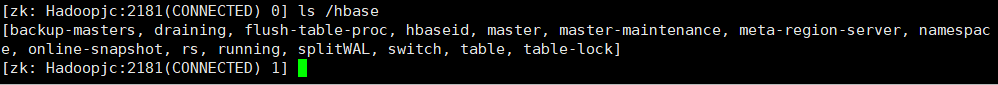

```shell
cd ~/Downloads/
sudo tar -zxf hbase-*.tar.gz -C /usr/local

cd /usr/local/
sudo mv ./hbase-* ./hbase
sudo chown -R jack:jack ./hbase
hbase version

#查看 HBase 在 Zookeeper 中的 znode
zkCli.sh -server Hadoopjc:2181

ls /hbase
```



