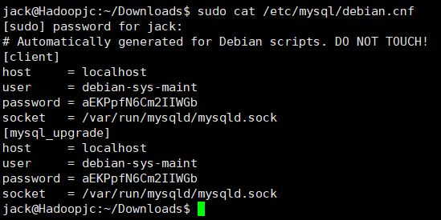
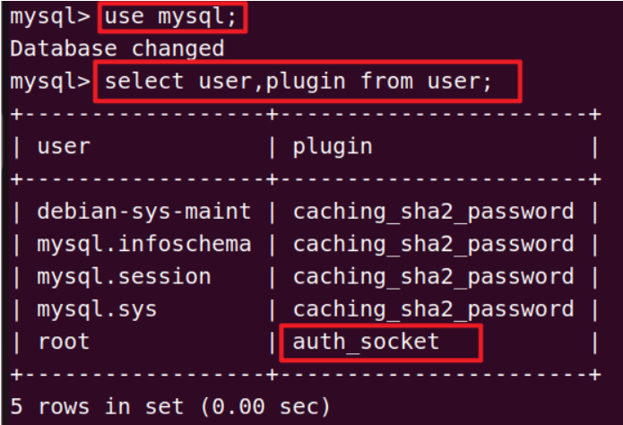
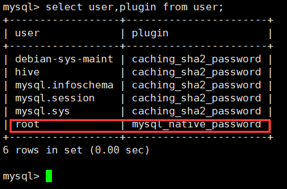

# 1、安装MySQL

```shell
    sudo apt-get update  #更新软件源
    sudo apt-get install mysql-server  #安装mysql
    mysql --version
```

## 8.0报错

ERROR 1698 (28000): Access denied for user ‘root’@'localhost’解决

在我们下载安装MySQL的过程中，系统会自动给我们创建一个用户，我们借助如下指令便可以查看该用户信息：

```shell
sudo cat /etc/mysql/debian.cnf
```



然后使用该用户名和密码**进入MySQL**：

```shell
mysql -u debian-sys-maint -p

#查看user表
use mysql;
select user,plugin from user;
```



```mysql
update user set plugin='mysql_native_password' where user='root'; # 修改其密码格式
flush privileges;
select user,plugin from user; # 查询其用户
```



增加root密码

```mysql
alter user 'root'@'localhost' identified by '**********';
flush privileges;
exit
```

重启

```shell
sudo service mysql restart
mysql -u root -p
```


2002 - Can't connect to server on '172.16.222.20'(10061)

```shell
CREATE USER 'root'@'%' IDENTIFIED WITH mysql_native_password BY '1q2w#E$R';

c
```

**改 MySQL 配置文件**

```shell
sudo vim /etc/mysql/mysql.conf.d/mysqld.cnf
```

bind - address 这一行默认情况下， bind - address 的值为 127.0.0.1 ，所以只能监听本地连接。我们需要将这个值改为远程连接 ip 可访问，可使用通配符 ip 地址 `*`， `::`， `0.0.0.0` ，当然也可以是单独的固定 ip，这样就仅允许指定 ip 连接，更加安全。

```
sudo systemctl restart mysql
sudo systemctl enable mysql
```


# 2、**配置mysql 8.0允许hive接入**

```sql
grant all on *.* to hive@localhost identified by 'hive';
```

## 报错

ERROR 1064 (42000): You have an error in your SQL syntax; check the manual that corresponds to your MySQL server version for the right syntax to use near 'identified by hive' at line 1


查看MYSQL手册：

```sql
CREATE USER 'hive'@'localhost' IDENTIFIED BY 'hive';
GRANT ALL ON *.* TO 'hive'@'localhost';
```

## 问题解决

```sql
create user 'hive'@'%' identified by 'hive';
grant all on *.* to 'hive'@'%';
flush privileges;
create database hive;
exit;
```


# **MySQL JDBC连接驱动JAR包**

https://dev.mysql.com/downloads/connector/j/

[https://mvnrepository.com/artifact/mysql/mysql-connector-java](http://xn--maven-9n1hw2bn16beer9rc0r)

