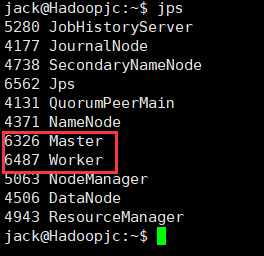
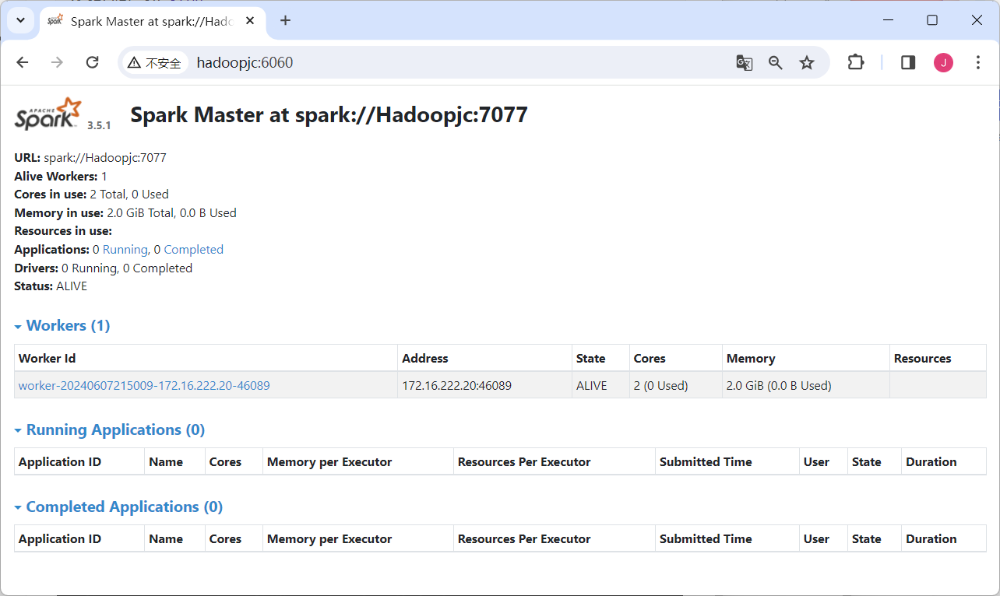
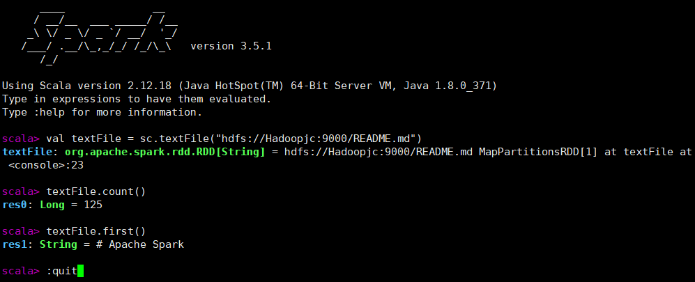
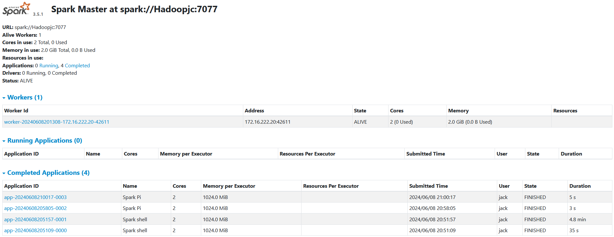
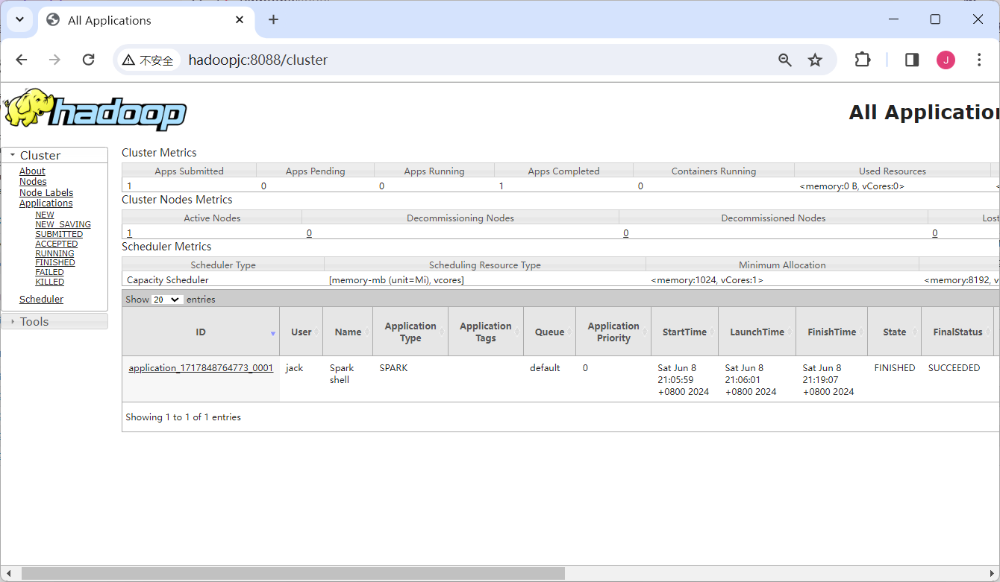

```shell
cd ~/Downloads
sudo tar -zxf spark-*.tgz -C /usr/local/

cd /usr/local
sudo mv ./spark-*/ ./spark
sudo chown -R jack:jack ./spark          # 此处的 hadoop 为你的用户名

vim ~/.bashrc
export SPARK_HOME=/usr/local/spark
export PATH=$SPARK_HOME/bin:$PATH
source ~/.bashrc

cd /usr/local/spark
cp ./conf/spark-env.sh.template ./conf/spark-env.sh

vim ./conf/spark-env.sh
export SPARK_DIST_CLASSPATH=$(/usr/local/hadoop/bin/hadoop classpath)
export SPARK_MASTER_HOST=Hadoopjc          #设置主节点地址
export SPARK_WORKER_MEMORY=2G           #设置节点内存大小
export SPARK_WORKER_CORES=2              #设置节点参与计算的核心数
export SPARK_WORKER_INSTANCES=1          #设置节点实例数
export JAVA_HOME=/usr/lib/jvm/jdk1.8.0_371
export HADOOP_CONF_DIR=/usr/local/hadoop/etc/hadoop
export SPARK_HOME=/usr/local/spark
export SPARK_MASTER_WEBUI_PORT=6060
export SPARK_WORKER_WEBUI_PORT=6066
export SPARK_WORKER_DIR=/usr/local/spark/work
export SPARK_LOG_DIR=/usr/local/spark/logs
export SPARK_HISTORY_OPTS="-Dspark.history.fs.logDirectory=hdfs://Hadoopjc:9000/sparklog/ -Dspark.history.fs.cleaner.enabled=true"


/usr/local/spark/sbin/start-all.sh
jps

```






# 独立集群管理器

（1）在集群中运行应用程序JAR包
 向独立集群管理器提交应用，需要把spark://Hadoopjc:7077作为主节点参数递给spark-submit。下面我们可以运行Spark安装好以后自带的样例程序SparkPi

```bash
cd /usr/local/spark
bin/spark-submit --class org.apache.spark.examples.SparkPi --master spark://Hadoopjc:7077 examples/jars/spark-examples_*.jar 100 2>&1 | grep "Pi is roughly"
```


（2）在集群中运行spark-shell
 也可以用spark-shell连接到独立集群管理器上。
 首先做一点准备工作，把一个README.md文件拷贝到HDFS上，用于后面的测试。

```bash
cd /usr/local/hadoop/
#把spark安装目录下README.md文件上传到分布式文件系统HDFS的根目录下
hadoop fs -put /usr/local/spark/README.md /
```

在Shell中输入如下命令启动进入spark-shell：

```bash
cd /usr/local/spark/bin/spark-shell --master spark://Hadoopjc:7077
```

在spark-shell中输入如下代码进行测试：

```scala
val textFile = sc.textFile("hdfs://Hadoopjc:9000/README.md")textFile: 
textFile.count()
textFile.first()
```



在独立集群管理Web界面查看应用的运行情况(http://Hadoopjc:6060/)



# Hadoop YARN管理器

（1）在集群中运行应用程序JAR包
 向Hadoop YARN集群管理器提交应用，需要把yarn-cluster作为主节点参数递给spark-submit。
 请登录Linux系统，打开一个终端，在Shell中输入如下命令：

```bash
bin/spark-submit --class org.apache.spark.examples.SparkPi --master yarn examples/jars/spark-examples_2.12-3.5.1.jar
```


（2）在集群中运行spark-shell
 也可以用spark-shell连接到独立集群管理器上。
 请登录Linux系统，打开一个终端，在Shell中输入如下命令启动进入spark-shell：

```scala
bin/spark-shell --master yarn

val textFile = sc.textFile("hdfs://Hadoopjc:9000/README.md")textFile: 
textFile.count()
textFile.first()
```

在Hadoop Yarn集群管理Web界面查看所有应用的运行情况，(http://Hadoopjc:8088/cluster) 
 
