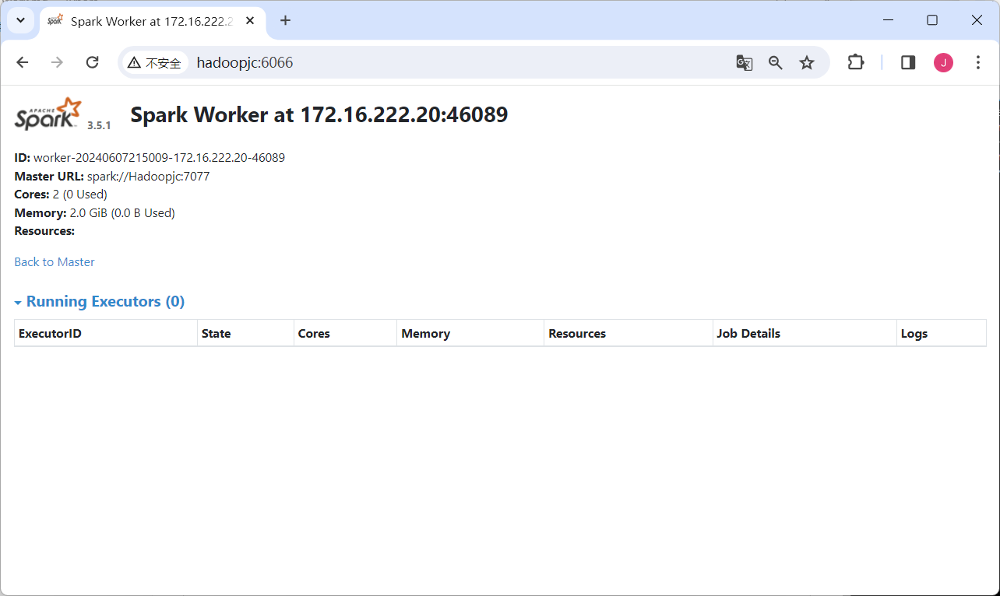

```shell
cd ~/Downloads
sudo tar -zxf spark-*.tgz -C /usr/local/

cd /usr/local
sudo mv ./spark-*/ ./spark
sudo chown -R jack:jack ./spark          # 此处的 hadoop 为你的用户名

vim ~/.bashrc
export SPARK_HOME=/usr/local/spark
export PATH=$SPARK_HOME/bin:$PATH
source ~/.bashrc

cd /usr/local/spark
cp ./conf/spark-env.sh.template ./conf/spark-env.sh

vim ./conf/spark-env.sh
export SPARK_DIST_CLASSPATH=$(/usr/local/hadoop/bin/hadoop classpath)
export SPARK_MASTER_HOST=Hadoopjc          #设置主节点地址
export SPARK_WORKER_MEMORY=2G           #设置节点内存大小
export SPARK_WORKER_CORES=2              #设置节点参与计算的核心数
export SPARK_WORKER_INSTANCES=1          #设置节点实例数
export JAVA_HOME=/usr/lib/jvm/jdk1.8.0_371
export HADOOP_CONF_DIR=/usr/local/hadoop/etc/hadoop
export SPARK_HOME=/usr/local/spark
export SPARK_MASTER_WEBUI_PORT=6060
export SPARK_WORKER_WEBUI_PORT=6066
export SPARK_WORKER_DIR=/usr/local/spark/work
export SPARK_LOG_DIR=/usr/local/spark/logs
export SPARK_HISTORY_OPTS="-Dspark.history.fs.logDirectory=hdfs://Hadoopjc:9000/sparklog/ -Dspark.history.fs.cleaner.enabled=true"


/usr/local/spark/sbin/start-all.sh
jps
```



