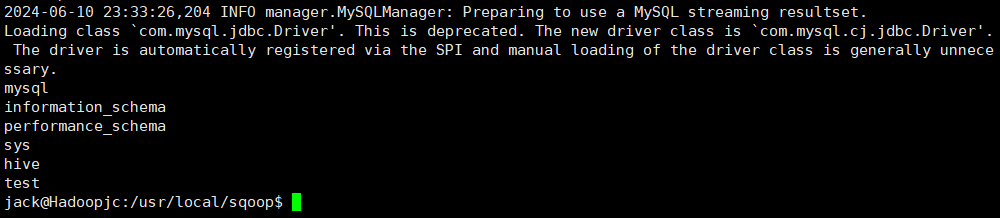

```shell
cd ~/Downloads
sudo tar -zxvf  sqoop-*.tar.gz -C /usr/local 

cd /usr/local
sudo mv ./sqoop-* ./sqoop
sudo chown -R jack:jack ./sqoop

vim ~/.bashrc
export SQOOP_HOME=/usr/local/sqoop
export PATH=$PATH:$SBT_HOME/bin:$SQOOP_HOME/bin
export CLASSPATH=$CLASSPATH:$SQOOP_HOME/lib
source ~/.bashrc
```

下载两个包A：sqoop-1.4.7.bin__hadoop-2.6.0.tar.gz、B：sqoop-1.4.7.tar.gz

提取压缩包里的部分jar包:

(1)提取A中sqoop-1.4.7.jar放到B的根目录

(2)提取A/lib/目录下的三个必须的jar包(ant-contrib-1.0b3.jar/ant-eclipse-1.0-jvm1.2.jar/avro-1.8.1.jar)+连接Mysql的JDBC包放到B/lib/目录下

其余的jar包我们不用导入，其余的从本地环境里的hadoop和hive中引用即可

```shell
cd /usr/local/sqoop/conf/
cat sqoop-env-template.sh  >> sqoop-env.sh  
#将sqoop-env-template.sh复制一份并命名为sqoop-env.sh
vim sqoop-env.sh 
#编辑sqoop-env.sh

export HADOOP_COMMON_HOME=/usr/local/hadoop
export HADOOP_MAPRED_HOME=/usr/local/hadoop
export HADOOP_CLASSPATH=$HADOOP_CLASSPATH:$HIVE_HOME/lib/*
export HBASE_HOME=/usr/local/hbase
export HIVE_HOME=/usr/local/hive
export HIVE_CONF_DIR=/usr/local/hive/conf
export ZOOCFGDIR=/usr/local/zookeeper

#测试
sqoop list-databases --connect jdbc:mysql://127.0.0.1:3306/ --username root -P
```


