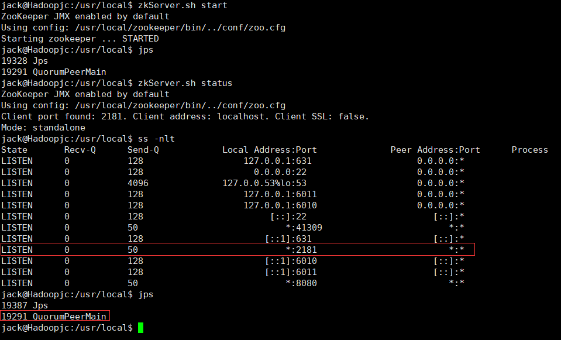

# 1.下载

官网地址  :  zookeeper.apache.org

如果服务器可以连接公网的话可以使用 wget 直接下载即可


    https://dlcdn.apache.org/zookeeper/zookeeper-3.7.2/apache-zookeeper-3.7.2-bin.tar.gz


​    

# 2.部署zookeeper

```shell
cd ~/Downloads/
sudo tar -zxvf apache-zookeeper-*-bin.tar.gz -C /usr/local

cd /usr/local
sudo mv apache-zookeeper-3.7.2-bin/ zookeeper
sudo chown -R jack:jack ./zookeeper
```

创建环境变量

```shell
vim ~/.bashrc

export ZK_HOME=/usr/local/zookeeper
export PATH=$PATH:$ZK_HOME/bin

source ~/.bashrc
```

修改配置文件

#zk启动的时候默认去读的时是 zoo.cfg 文件

```
cp /usr/local/zookeeper/conf/{zoo_sample.cfg,zoo.cfg}
```

# 3.启动zookeeper单点服务

    zkServer.sh start
    zkServer.sh status
    ss -nlt
    jps

