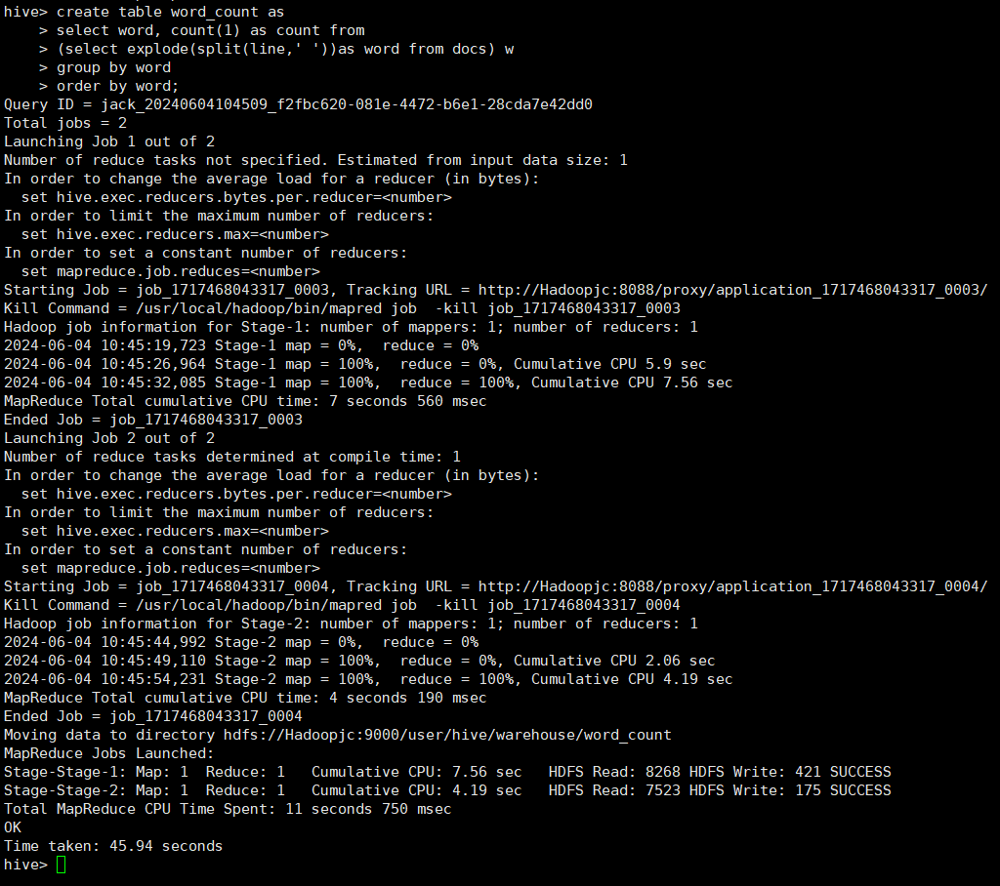
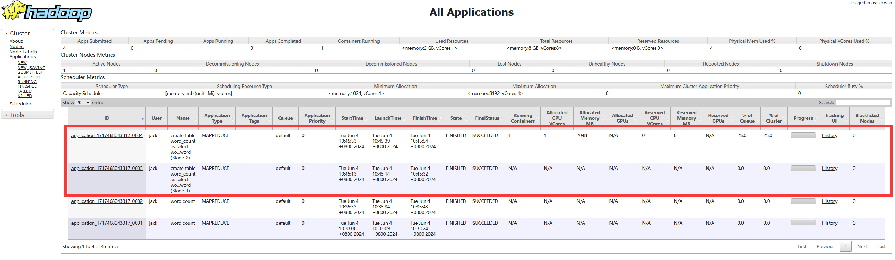
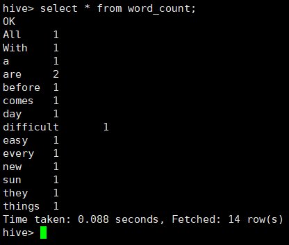

词频统计算法是最能体现MapReduce思想的算法之一，这里我们可以对比它在MapReduce中的实现，来说明使用Hive后的优势。

MapReduce实现词频统计的代码在  $HADOOP_HOME/share/hadoop/mapreduce/hadoop-mapreduce-examples-3.3.5.jar  包中找到(wordcount类)，wordcount类由63行Java代码编写而成。


1）创建input目录，output目录会自动生成。其中input为输入目录，output目录为输出目录。

```language-shell
mkdir -p /usr/local/hadoop/input
```

2）在input文件夹中创建两个测试文件file1.txt和file2.txt

```language-shell
cd  /usr/local/hadoop/input
echo "All things are difficult before they are easy" > txt1.txt
echo "With every sun comes a new day" > txt2.txt

cd  ..
hdfs dfs -rm -r output
hadoop jar share/hadoop/mapreduce/hadoop-mapreduce-examples-3.3.5.jar wordcount input output
hdfs dfs -cat output/*
```


通过HiveQL实现词频统计功能，此时只要编写下面7行代码，而且不需要进行编译生成jar来执行。

```language-sql
create table docs(line string);
load data inpath 'file:///usr/local/hadoop/input' overwrite into table docs;
create table word_count as 
select word, count(1) as count from
(select explode(split(line,' '))as word from docs) w
group by word
order by word;
```



执行后，用select语句查看



```sql
select * from word_count;
```

