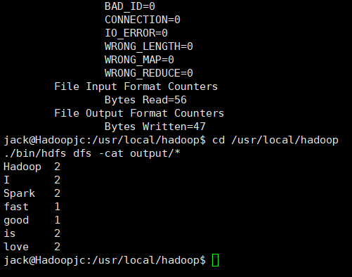
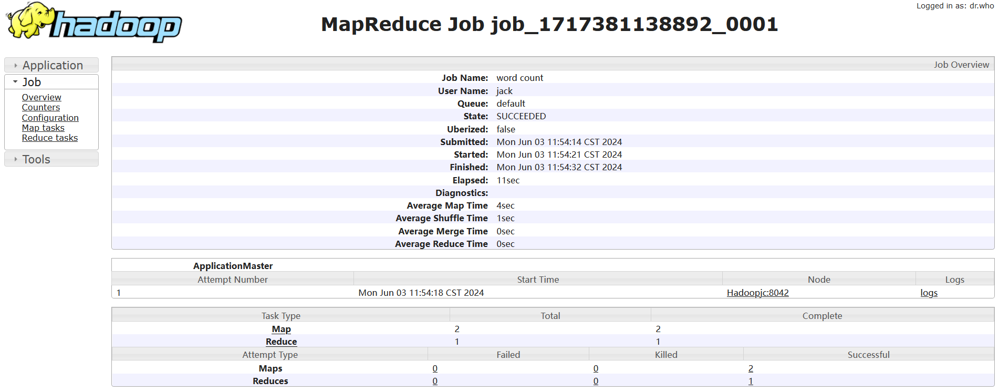

MapReduce是谷歌公司的核心计算模型，Hadoop开源实现了MapReduce。MapReduce将复杂的、运行于大规模集群上的并行计算过程高度抽象到了两个函数：Map和Reduce，并极大地方便了分布式编程工作，编程人员在不会分布式并行编程的情况下，也可以很容易将自己的程序运行在分布式系统上，完成海量数据的计算。
词频统计任务

首先，在Linux系统本地创建两个文件，即文件wordfile1.txt和wordfile2.txt。在实际应用中，这两个文件可能会非常大，会被分布存储到多个节点上。但是，为了简化任务，这里的两个文件只包含几行简单的内容。需要说明的是，针对这两个小数据集样本编写的MapReduce词频统计程序，不作任何修改，就可以用来处理大规模数据集的词频统计。
文件wordfile1.txt的内容如下：

```
I love Spark
I love Hadoop
```

文件wordfile2.txt的内容如下：

```
Hadoop is good
Spark is fast
```

假设HDFS中有一个/user/hadoop/input文件夹，并且文件夹为空，请把文件wordfile1.txt和wordfile2.txt上传到HDFS中的input文件夹下。现在需要设计一个词频统计程序，统计input文件夹下所有文件中每个单词的出现次数

1、先查看HDFS中文件

```bash
hdfs dfs -ls
```
2、按要求开始文件创建并编辑文件中文本内容

```bash
echo "I love Spark
I love Hadoop" > wordfile1.txt

echo "Hadoop is good
Spark is fast" > wordfile2.txt
```
3、将本地文件copy到HDFS上

```bash
hadoop fs -put wordfile1.txt /user/jack/input
hadoop fs -put wordfile2.txt /user/jack/input


hdfs dfs -ls /user/jack/input

```

4、打包构建为WordCount.jar放到桌面

5、运行测试

```bash
hdfs dfs -rm -r /user/jack/output

hadoop jar ~/Desktop/WordCount.jar input output
hdfs dfs -cat output/*
```




